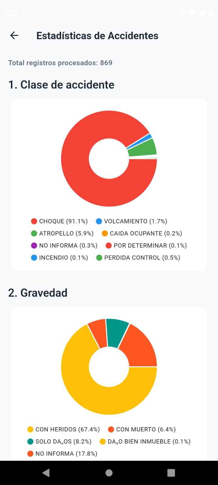
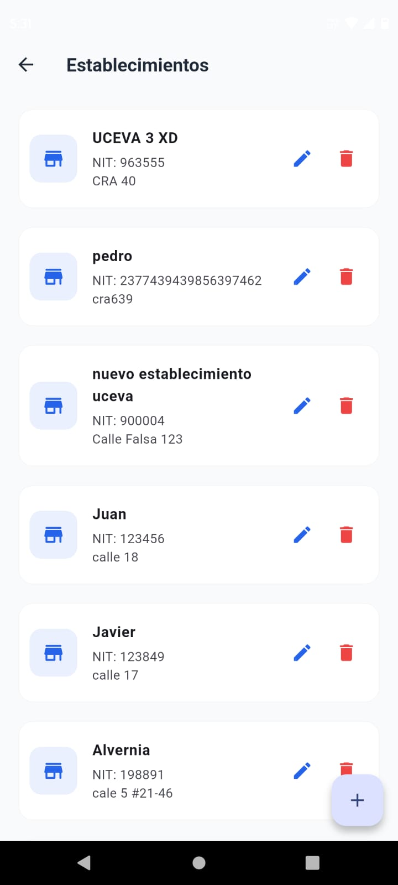
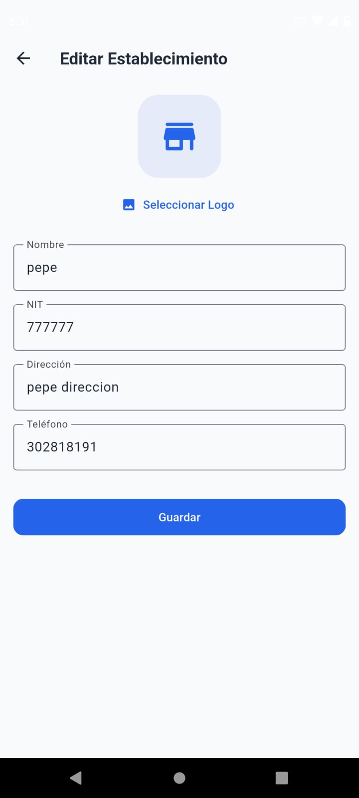

# Documentación del Proyecto (Parcial 2 - Flutter)

## Descripción de las APIs Integradas

El proyecto consume de manera simultánea dos interfaces API para abastecer módulos diferentes con lógicas particulares.

### API 1: Accidentes de Tránsito Tuluá (Datos Abiertos Colombia)
- **Fuente**: Datos Abiertos del Gobierno de Colombia.
- **Base URL**: `https://www.datos.gov.co/resource/ezt8-5wyj.json`
- **Endpoints Usados**: 
  - `GET ...ezt8-5wyj.json?$limit=100000`: Utilizado para la descarga masiva de todos los accidentes viales registrados. No requiere autenticación, por lo cual es posible consumir de manera directa esta API abierta.
- **Campos Relevantes Extraidos**: 
  - `clase_de_accidente`: Tipo de impacto (e.g., CHOQUE, ATROPELLO).
  - `gravedad_del_accidente`: Consecuencias del accidente (e.g., CON HERIDOS).
  - `barrio_hecho`: Lugar de ocurrencia.
  - `dia`: Día de la semana (e.g., martes).
  - *También provee extra info*: `hora`, `area`, `clase_de_vehiculo`, `fecha`.

### API 2: Establecimientos (API Parqueadero Visión TIC)
- **Fuente**: API RESTful propia (Parqueadero).
- **Base URL**: `https://parking.visiontic.com.co/api`
- **Endpoints Usados**:
  - `GET /establecimientos`: Obtener listado de todos los establecimientos vigentes.
  - `GET /establecimientos/{id}`: Ver el detalle de un registro único.
  - `POST /establecimientos`: Creación mediante Form-Data (`multipart/form-data`) para soportar carga de imágenes.
  - `POST /establecimiento-update/{id}`: Actualización de datos. *(Nota técnica: La instancia web rechaza la cabecera con spoofing `_method=PUT`, por lo cual se aborda la edición con `POST` estándar mediante FormData)*.
  - `DELETE /establecimientos/{id}`: Borrado físico del registro en base de datos.
- **Campos Relevantes Evaluados**: `id`, `nombre`, `nit`, `direccion`, `telefono`, `logo` (campo que acepta subida de imágenes).

---

## Future, async/await vs Isolate

### ¿Cuándo usar qué?
- **Future, `async` y `await`**: Se utilizan prioritariamente de manera concurrente para **tareas relacionadas a I/O** (Entrada y Salida o Input/Output), como llamadas por red (HTTP Request), peticiones asíncronas de base de datos, lectura o escritura en el local storage, etc. Trabajan en el mismo hilo de ejecución principal (Event Loop), por lo que si se ocupan en matemáticas laboriosas, causarán un cuello de botella o "bloquearían" la UI temporalmente afectando los frames mostrados (*Janks/Lags*).
- **Isolate (`Isolate.run` / `compute`)**: Deben reservarse restrictívemente para **tareas "CPU-bound"** (Uso altamente intensivo de procesador o parsing de datos inmensos). Flutter transfiere completamente el procesamiento hacia un core individual que posee un espacio de memoria totalmente aislado, lo cual evita que la aplicación principal sufra caídas de rendimiento visual o caiga en un estado irreceptivo (frozen screen).

### Justificación de Isolate en el Módulo de Accidentes
El dataset de "Datos Abiertos - Tulua" implica descargas masivas con capacidad de sobrepasar fácilmente magnitudes de de los `100,000` registros (Arrays JSON a procesar localmente uno por uno). Si obligásemos a nuestro hilo principal a:
1) Iterar sobre miles de mapas,
2) Instanciar objetos `AccidenteModel`, 
3) Efectuar operaciones como ordenamiento `sort()` o sumas iterativas para recoletar "el top 5 barrios" ... 

La memoria bloquearía la App por milisegundos notables generando una congelación frustrante e incómoda para la UX (User Experience). Optamos por despachar todas esas operaciones laboriosas fuera de la UI con `Isolate.run()` el cual "offloadea" la carga algorítmica pesada a otro espacio, devolviendo de manera transparente nuestros conteos matemáticos consolidados ya listos para tan solo ser graficados pasivamente.

---

## Arquitectura y Estructura del Proyecto

La app emplea una variante de la **Clean Architecture**, dividiendo fuertemente el código según su dominio y reusabilidad:

- **`config/`**: Variables constantes globales, tiempos de timeout (para Dio HTTP) e interoperabilidad con variables de entorno `.env` provistas por `flutter_dotenv`.
- **`models/`**: Representación y definición del dato de Negocios en formato Dart (`AccidenteModel`, `EstablecimientoModel`). Contienen sus descriptivos factory de `fromJson` o `.toJson`.
- **`services/`**: Concentra exclusívamente las reglas y lógicas de comunicación externa. Administra los clientes Singleton construidos por `DioClient` con interceptores y encapsulación para `try/catch`. Independientes asbóltumente de los Widgets UI.
- **`isolates/`**: Ubica las funciones "Top-Level" encargadas del análisis masivo aislado (Ej: `procesarAccidentesEnIsolate`). Imprime tiempos y libera métricas.
- **`themes/`**: Variables visuales estáticas concentradas bajo una paleta semántica. Regula globalmente el aspecto de Material Components a través de `AppTheme.dart`.
- **`routes/`**: Archivo contenedor `app_router.dart` de la lógica para entrelazar las ventanas orgánicamente manejadas por el estándar `go_router`.
- **`views/`**: Pantallas principales completas y de layout (`DashboardView`, `AccidentesView`, `EstablecimientosListView`, etc.)
- **`widgets/`**: Fragmentos reutilizables en un ecosistema que ahorra esfuerzo modular (`StatBarChart`, `StatPieChart`, `ModuleCard`, `LogoWidget`).

---

## Rutas Implementadas (Go Router)

Se utilizaron rutas declarativas de gestión dinámica (`go_router`) con constantes en `AppRoutes`:

- **`/` (`DashboardView`)**: Menú de bienvenida de inicialización. Vista principal Root (presentación UI).
- **`/accidentes` (`AccidentesView`)**: Visualización de análisis masivos (Muestra la Data gráfica).
- **`/establecimientos` (`EstablecimientosListView`)**: Listado interaccionable y de recarga (RefreshIndicator).
- **`/establecimiento-form` (`EstablecimientoFormView`)**: Pantalla inteligente polimórfica para formulario de edición/creación. 
  - **Envío de Parámetros Dinámico**: Durante redireccionamientos para "Agendar/Ver detalles", se envía serializando todo el objeto base vía `extra`:
    ```dart
    // Redirige al formulario enviando los estados precargados si es el caso de una Edición (IconPencil / Update Route):
    context.push(AppRoutes.establecimientoForm, extra: modeloOriginalAAfectar)
    ``` 
    La ruta verifica si el objeto recibido del `state.extra as EstablecimientoModel?` existe, asumiendo su visual como **Actualización**. O, si no se emitió nada asume **Creación**.

---

## Capturas de Pantalla

*(Nota docente: Agrega tus pantallazos localmente dentro del repo insertando las imágenes en las ubicaciones listadas a continuación)*

1. **Dashboard Principal**:


2. **Estadísticas (4 gráficas aisladas procesando `flutter_chart`)**:



3. **Listado de Establecimientos (Esleto y Listado real `ListView.separated`)**:

4. **Formulario de Creación (Limpio)**:


---

## Ejemplos de Respuestas API (JSON)

### 1. API Accidentes - Tuluá
`[ Array Contenedor Global ] -> Objetos JSON`
```json
[
  {
    "a_o": "2023",
    "fecha": "2023-01-03T00:00:00.000",
    "dia": "martes",
    "hora": "15:40:00",
    "area": "URBANA",
    "direccion_hecho": "CARRERA 21 CALLE 32",
    "controles_de_transito": "VERTICAL",
    "barrio_hecho": "SAJONIA",
    "clase_de_accidente": "CHOQUE",
    "clase_de_servicio": "PARTICULAR",
    "gravedad_del_accidente": "CON HERIDOS",
    "clase_de_vehiculo": "MOTOCICLETA"
  }
]
```

### 2. API Establecimientos REST - (Respuesta POST de Crud Exitosa: Código `200` o `201`)
`Estructura Wrappeada típica de Laravel`
```json
{
  "success": true,
  "message": "Establecimiento creado correctamente",
  "data": {
    "nombre": "Prueba App",
    "nit": "900123456",
    "direccion": "Calle 1 #2-3 Tuluá",
    "telefono": "3001234567",
    "estado": "A",
    "logo": "ruta_guardada_en_almacenamiento.png",
    "updated_at": "2026-04-23T22:13:08.000000Z",
    "created_at": "2026-04-23T22:13:08.000000Z",
    "id": 94
  }
}
```
